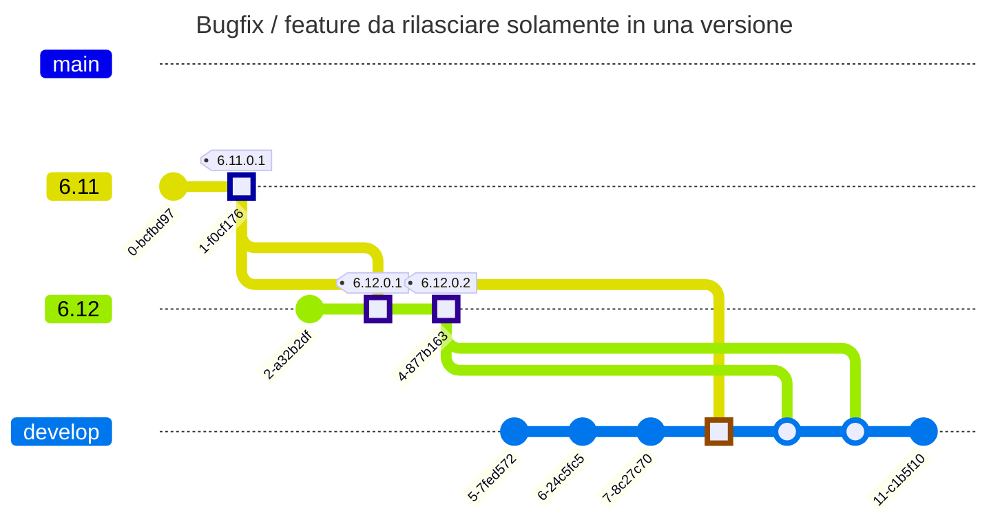

```mermaid
---
title: Bugfix / feature da rilasciare solamente in una versione
---
gitGraph
   branch 6.11
   branch 6.12
   branch develop
   checkout 6.11
   commit
   commit type: HIGHLIGHT tag: "6.11.0.1"   
   checkout 6.12
   commit
   merge 6.11 type: HIGHLIGHT tag: "6.12.0.1"
   commit type: HIGHLIGHT tag: "6.12.0.2"
   checkout develop
   commit
   commit
   commit
   merge 6.11 type: HIGHLIGHT   
   merge 6.12
   merge 6.12
   commit
   checkout 6.11
   
   
```
