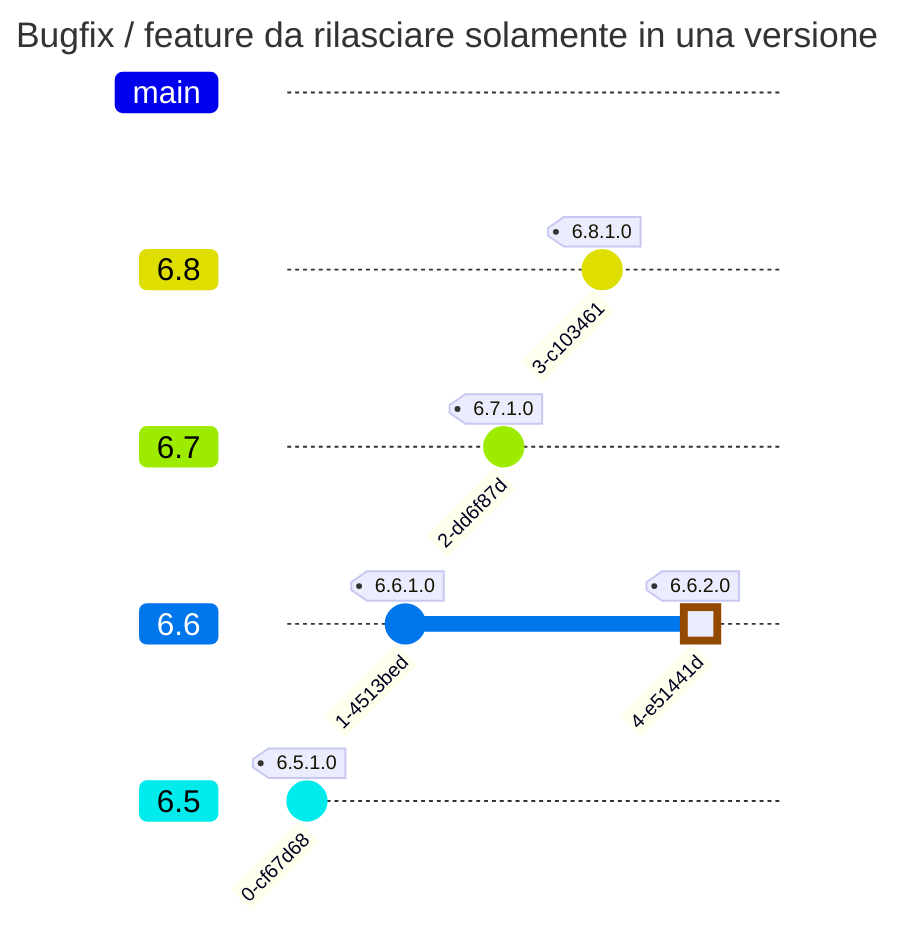

```mermaid
---
title: Bugfix / feature da rilasciare solamente in una versione
---
gitGraph
   branch 6.8
   branch 6.7
   branch 6.6
   branch 6.5
   checkout 6.5
   commit  tag: "6.5.1.0"
   checkout 6.6
   commit  tag: "6.6.1.0"
   checkout 6.7
   commit  tag: "6.7.1.0"
   checkout 6.8
   commit  tag: "6.8.1.0"  
   checkout 6.6
   commit type: HIGHLIGHT tag: "6.6.2.0"
```
